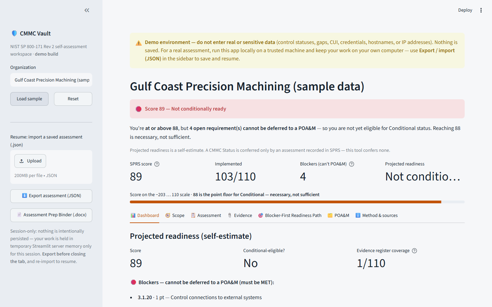
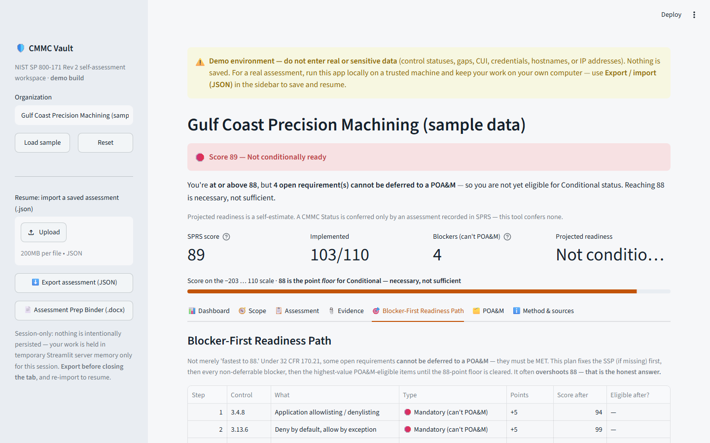
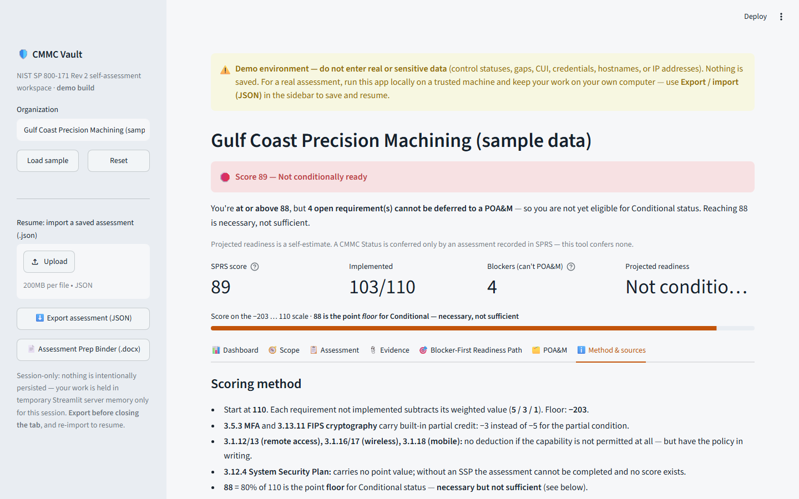

# CMMC Vault

[](https://github.com/CJud25/CMMCVault/actions/workflows/ci.yml)

A session-only web application that helps small U.S. defense contractors understand
their readiness for **CMMC Level 2** by scoring a **NIST SP 800-171** self-assessment
the way the Department of Defense does — and, more importantly, by making one easily
missed truth impossible to ignore:

> **Reaching a score of 88 (80%) is necessary but *not sufficient* for CMMC
> "Conditional" status.** Eligibility is a *compound gate* defined in 32 CFR 170.21,
> and a contractor can sit above the threshold and still be ineligible.

CMMC Vault is a focused, session-only teaching tool for guided readiness
conversations. It is **not** a compliance platform, and it is deliberately transparent
about what it can and cannot do (see
[What it is — and is not](#what-it-is--and-is-not)).

**63 tests** · **98% coverage** of the core logic modules (`logic/` — scoring,
readiness, scoping, catalog), measured with `pytest --cov`. See
[Testing and verification](#testing-and-verification).

**Run it in 3 commands:**

```bash
git clone https://github.com/CJud25/CMMCVault.git && cd CMMCVault
pip install -r requirements.txt
streamlit run app.py
```

> Run the app **locally** for any real assessment; the [hosted demo](#live-demo) is
> for the built-in **sample only** (see the safety note below).



---

## Live demo

**Hosted demo:** https://cmmcvault-demo.streamlit.app/

> ⚠️ **The hosted demo is for demonstration with the built-in sample only.**
> **Do not enter real or sensitive organizational data into the hosted app** — no
> control statuses, gaps, CUI, credentials, hostnames, IP addresses, or system
> identifiers. The hosted version has no login and runs on shared public
> infrastructure; although the app persists nothing, whatever you type lives in that
> host's memory during your session.
>
> **For a real assessment, run the app locally first.** Download or clone this
> repository, run it on a trusted machine (see [Getting started](#getting-started)),
> and keep your work on your own computer via the JSON export. Use the hosted link for
> demonstrations and walkthroughs only.

---

## Table of contents

- [Live demo](#live-demo)
- [The core idea](#the-core-idea)
- [What it is — and is not](#what-it-is--and-is-not)
- [Features](#features)
- [Getting started](#getting-started)
- [Guided walkthrough](#guided-walkthrough)
- [Screens](#screens)
- [The compound eligibility gate](#the-compound-eligibility-gate-32-cfr-17021)
- [Data handling and privacy](#data-handling-and-privacy)
- [Accuracy, provenance, and the guidance content](#accuracy-provenance-and-the-guidance-content)
- [Regulatory framework and freshness](#regulatory-framework-and-freshness)
- [Architecture](#architecture)
- [Project structure](#project-structure)
- [Testing and verification](#testing-and-verification)
- [Current limitations](#current-limitations)
- [Out of scope (intentionally frozen)](#out-of-scope-intentionally-frozen)
- [Security](#security)
- [Attribution and licensing](#attribution-and-licensing)
- [Disclaimer](#disclaimer)

---

## The core idea

DoD's SPRS scoring model starts every organization at **110 points** and subtracts a
weighted value (**5, 3, or 1**) for each of the 110 NIST SP 800-171 requirements that
is not implemented. Most self-assessment spreadsheets stop there and treat **88** (80%
of 110) as a finish line.

It is not a finish line. Under 32 CFR 170.21, a contractor may only obtain
**Conditional** CMMC status if it can place every unmet requirement on a Plan of
Action and Milestones (POA&M) — and several requirements **cannot be placed on a
POA&M at all**. A score of 89 with the wrong requirement still open is **not
eligible**.

CMMC Vault makes that concrete. The bundled sample organization scores exactly **89**
and is still **"Not conditionally ready,"** because three 5-point requirements and one
of the five never-deferrable 1-point requirements are open. Every feature in the tool
exists to explain that gap and turn it into an ordered plan of work.

## What it is — and is not

**It is:**

- A **self-assessment aid** and a **readiness self-estimate**.
- A **teaching and conversation tool** for CMMC Level 2 readiness.
- **Session-only**: no accounts, no database, and nothing persisted on a server.

**It is not:**

- **Not** a certification, an official assessment, or a substitute for a
  **CMMC Third-Party Assessment Organization (C3PAO)**.
- **Not** legal advice.
- **Not** a system of record: it confers **no CMMC status** of any kind — a CMMC
  status is granted only by an assessment recorded in SPRS.

The application states this in its own interface (an "About this tool & its
limitations" panel and an explicit table mapping the tool's self-estimates to official
CMMC statuses), so a user is never left with the impression that the tool decides
their standing.

## Features

| Area | What it does |
| --- | --- |
| **SPRS scoring** | Scores all 110 NIST SP 800-171 requirements (start 110; deduct 5/3/1; floor −203), including the two partial-credit special cases (3.5.3 MFA, 3.13.11 FIPS-validated cryptography). |
| **Compound readiness verdict** | Computes true **Conditional-status eligibility** per 32 CFR 170.21 — not just the score — and names the specific requirements that block it. |
| **Blocker-First Readiness Path** | An ordered remediation plan that fixes the System Security Plan first, then every non-deferrable ("cannot be POA&M'd") requirement, then the highest-value remaining items. It honestly overshoots 88 when the rules require it. |
| **Scope wizard** | Defines the assessment boundary and asset inventory (the five CMMC Level 2 scoping categories) *before* assessment, and only then permits marking the relevant controls "N/A — capability not permitted." |
| **Evidence register** | Tracks, per control, *what* evidence is needed, *where* it lives, *who* owns it, and three independent status axes — document, implementation, and review — so a signed-but-unimplemented policy is never mistaken for operational evidence. Metadata only; **no files are stored**. |
| **Executive dashboard** | A leadership view: projected readiness, open 5/3/1-point counts, evidence-register coverage, blocking requirements, and risks that undercut prime/customer confidence. |
| **POA&M tracking** | Flags any POA&M item that is not actually POA&M-eligible, with a 180-day Conditional→Final countdown anchored only to a user-entered assessment date. |
| **Plain-English guidance** | For all 110 controls: what the requirement means, what evidence satisfies an assessor, and the fastest concrete first step — written for a ~25-person shop. |
| **Assessment Prep Binder** | A downloadable `.docx` for leadership, primes, or C3PAO preparation: cover verdict, an app-to-CMMC status mapping, an SSP skeleton, a 110-row control-implementation matrix, a POA&M with eligibility flags, and an evidence index. |
| **Save / resume** | Export the session to JSON and re-import it later. Imports are validated and sanitized. |

## Getting started

**Requirements:** Python 3.11+ and the packages in `requirements.txt`
(Streamlit, pandas, python-docx).

```bash
# from the project root
pip install -r requirements.txt
streamlit run app.py
```

The application opens in your browser. Use **Load sample** in the sidebar to explore
the bundled example, or **Reset** to start a blank assessment.

> **Operating posture.** Sessions involving a real organization's data should be run
> **locally** (`streamlit run app.py` on a trusted machine). The
> [hosted demo](#live-demo) (https://cmmcvault-demo.streamlit.app/) is for
> demonstrating the **sample only** — never enter a real organization's data there.
> See [Data handling and privacy](#data-handling-and-privacy).

## Guided walkthrough

A 60-second demonstration centered on the sample organization:

1. **Load sample** (sidebar). The example is a small machine shop that believes it is
   nearly ready.
2. **Dashboard.** The headline reads **"Score 89 — Not conditionally ready."** The
   organization is *above* the 88-point floor and still ineligible.
3. **The blockers.** Three open 5-point requirements (3.4.8, 3.13.6, 3.14.6) and one
   1-point requirement (3.1.20) that **cannot be placed on a POA&M**. Score gets you in
   the room; clearing these gets you eligible.
4. **Blocker-First Readiness Path.** Non-deferrable items are listed first; the
   projected score overshoots 88 because those items must be met regardless of the
   point math.
5. **Scope** and **Evidence** tabs. Define the boundary first — that is what earns the
   right to mark a control "N/A" — then organize evidence by owner, location, and its
   document / implementation / review status.
6. **Assessment Prep Binder** (sidebar). Generates the `.docx` package a contractor
   brings *to* an assessment.

## Screens

| | |
|---|---|
|  |  |
| **Blocker-First Readiness Path** — the exact requirements that must be *met* (not POA&M-deferred) before the sample org becomes eligible | **Method & sources** — every control's scoring weight and citation, kept auditable |

_Sample data only. The hero above shows the sample organization at score 89 — above the 88 floor yet **not** conditionally ready, because four requirements cannot be deferred to a POA&M._

## The compound eligibility gate (32 CFR 170.21)

For **Conditional** CMMC status, a POA&M is permitted only if **all** of the following
hold:

1. The assessment score is **≥ 88** (80% of 110), **and**
2. Every open (not-met) requirement placed on the POA&M is worth **no more than 1
   point** — with a single exception: **3.13.11** (CUI encryption) may be deferred when
   encryption is in use but not FIPS-validated (the −3 partial), **and**
3. **None** of six specific requirements are open, because they can **never** be
   placed on a POA&M: five 1-point requirements — **3.1.20, 3.1.22, 3.10.3, 3.10.4,
   3.10.5** — plus the **System Security Plan (3.12.4)**, which is unscored but
   mandatory (without it, no valid assessment exists).

POA&M items must be closed and confirmed within **180 days** of the Conditional status
date, or the status expires. The ruleset is stored as data in
`data/poam_eligibility.json` and is asserted on every build.

## Data handling and privacy

CMMC Vault is **session-only by design.**

- **No persistent storage.** There is no database and no user account system. Your
  work is held in temporary Streamlit server memory only for the duration of your
  session and is discarded when the session ends (on the hosted demo, that server is
  Streamlit Community Cloud). Export to JSON to save your work, and re-import to resume.
- **No evidence files are uploaded or stored.** The evidence register holds *metadata
  and pointers* only (a title, an owner, a location such as "SharePoint > Compliance"),
  never the evidence files themselves. (The one file the app reads is your own saved
  session `.json` on import, which is validated and never written back to a server.)
- **No outbound network calls.** The application makes no external requests; it neither
  transmits nor phones home with any assessment data.
- **A clear data boundary.** The interface instructs users **not** to enter real
  Controlled Unclassified Information (CUI), credentials, IP addresses, hostnames, or
  system identifiers — a contractor's control statuses and gap list are themselves
  sensitive, so the tool asks for generic names and location pointers only. This
  applies everywhere, and **especially to the [hosted demo](#live-demo)**: for real
  data, run the app locally and keep your work on your own machine.
- **Validated imports.** An imported JSON file is sanitized before use: statuses and
  dates are validated, unknown identifiers are dropped, the embedded score is ignored
  and recomputed, unsafe link schemes and formatting are neutralized, and any status
  that no longer matches the declared scope is reset with a warning.

## Accuracy, provenance, and the guidance content

- **Requirement weights** are transcribed from the *NIST SP 800-171 DoD Assessment
  Methodology, Version 1.2.1 (2020-06-24), Annex A* (via a public mirror of the
  official document — verify against the official DoD PDF before high-stakes use). The
  **POA&M eligibility rules** are taken from *32 CFR 170.21*.
- **Build-time validation** (`scripts/build_catalog.py --check`) asserts the published
  weight distribution (44 × 5-point, 14 × 3-point, 51 × 1-point, 1 non-scored SSP;
  score floor −203), the eligibility ruleset, and that the sample scores **exactly 89
  and is not conditionally ready** — so neither the data nor the teaching example can
  silently drift.
- **Plain-English guidance** for all 110 controls was **drafted with AI assistance**
  against the NIST SP 800-171 Rev 2 requirement text and NIST SP 800-171A assessment
  objectives, then passed a structured, source-grounded review. **That review was a
  source-checked editorial pass — not a sign-off by a licensed CMMC professional or
  C3PAO.** The guidance is advisory and should be validated by a qualified professional
  before it informs a contract decision. Requirement text is quoted from NIST SP
  800-171 Rev 2, a U.S. Government work in the public domain.
- **Before relying on any result with a real organization,** spot-check
  `data/controls.json` against the official DoD source document, run
  `python scripts/build_catalog.py --check`, and have a qualified professional validate
  conclusions that will inform a contract decision.

## Regulatory framework and freshness

_Last reviewed: 2026-07-05._

**Framework versions this build encodes.** The catalog and scoring engine are built
against a specific, pinned set of source documents — not "CMMC in general":

- **NIST SP 800-171 Revision 2** — the 110 security requirements and the requirement
  text quoted in the guidance.
- **NIST SP 800-171 DoD Assessment Methodology, Version 1.2.1 (2020-06-24), Annex A** —
  the SPRS point weights (5 / 3 / 1) and the −203 to 110 score range.
- **NIST SP 800-171A** — the assessment objectives the plain-English guidance is
  written against.
- **32 CFR 170.21** (the CMMC Program rule, i.e. "CMMC 2.0") — the CMMC Level 2
  **self-assessment** eligibility rules and the POA&M / Conditional-status gate
  (`data/poam_eligibility.json`, verified 2026-07-04).

This is a **readiness self-estimate** and **not** a certification, an official
assessment, or a CMMC status of any kind (see [Disclaimer](#disclaimer)).

**Verify against the official sources.** Before relying on any result, confirm this
build against the authoritative documents from their official publishers — not this
repository and not any third-party mirror:

- **NIST SP 800-171 Rev 2** and **SP 800-171A** — the NIST Computer Security Resource
  Center (`csrc.nist.gov`), which hosts the official PDFs.
- **NIST SP 800-171 DoD Assessment Methodology** — the DoD / DCMA DIBCAC source PDF.
- **32 CFR Part 170** (CMMC Program) — the official Code of Federal Regulations
  (`ecfr.gov`) and the DoD CIO CMMC pages.

**What you MUST re-verify before any high-stakes use** (a contract decision, an SPRS
submission, or a C3PAO engagement):

- Whether a **newer revision** of NIST SP 800-171 (for example, Rev 3) or an updated
  DoD Assessment Methodology has superseded the versions above, and whether it changes
  any requirement, point weight, or the score range this tool assumes.
- Whether **32 CFR Part 170** has been amended since 2026-07-04 in a way that changes
  the ≥ 88 threshold, the list of never-deferrable requirements, or the 180-day
  Conditional→Final clock.
- The per-requirement weights in `data/controls.json` and the eligibility ruleset in
  `data/poam_eligibility.json`, spot-checked against the official PDFs — then re-run
  `python scripts/build_catalog.py --check`.

**Update cadence.** These references are **not** auto-updated; the tool makes no
outbound calls and cannot detect an amended regulation. This note is dated so it is
obvious when it was last reconciled. Re-check the sources above at least **quarterly**,
and immediately whenever DoD or NIST announces a change to the CMMC Program or to
SP 800-171. Treat any result as potentially stale until the source versions have been
re-confirmed for your assessment date.

## Architecture

The design keeps a small, well-tested core pure and free of framework dependencies,
and adds everything else around it:

- **`logic/scoring.py`** — the SPRS scoring engine. Pure functions, no I/O, frozen
  behavior pinned by a fixed test suite.
- **`logic/readiness.py`** — the compound eligibility gate, the Blocker-First path,
  the dashboard summary, per-control readiness labels, and the 180-day clock. Pure.
- **`logic/scoping.py`** — derives which controls may be marked "N/A" from the scope
  answers, and reconciles the assessment when scope changes. Pure.
- **`export/binder.py`** — generates the Assessment Prep Binder as `.docx` bytes.
  Pure; reuses the same dashboard summary the UI shows, so the document and the screen
  can never disagree.
- **`persistence.py`** — validates and sanitizes imported JSON. Pure.
- **`disclosures.py`** — shared honesty and transparency content (the status-mapping
  table, disclaimers, and the data-boundary notice), so the same wording appears in the
  UI and the exported binder.
- **`app.py`** — the Streamlit user interface. The only module that renders; it holds
  no business logic that the pure modules do not.
- **`scripts/build_catalog.py`** — builds and validates `data/controls.json` from the
  authoritative requirement list, guidance, and the sample. Run with `--check` in CI.

A machine-checked **language contract** (`docs/language-contract.md`, enforced by a
test) scans the interface, the binder, the README, and the guidance so that no wording
ever claims the tool grants CMMC compliance or an official status.

## Project structure

```
app.py                      Streamlit UI
disclosures.py              Shared transparency / disclaimer content
persistence.py              Validated JSON import
logic/
  scoring.py                SPRS scoring engine (frozen, pure)
  readiness.py              Compound eligibility gate + dashboard (pure)
  scoping.py                Scope-earned N/A logic (pure)
  catalog.py                Loads the built control catalog + rulesets
export/
  binder.py                 Assessment Prep Binder (.docx) generator (pure)
data/
  controls.json             Built catalog: 110 controls, weights, guidance
  poam_eligibility.json     32 CFR 170.21 POA&M ruleset (source of truth)
  sample_assessment.json    The "89-but-not-ready" sample (fictional)
  guidance_reviewed_batch.json  Reviewed plain-English guidance
scripts/
  build_catalog.py          Builds + validates the catalog (run with --check)
docs/
  language-contract.md      Forbidden/approved wording, enforced by a test
tests/                      unittest suites (see below)
```

## Testing and verification

```bash
python -m unittest discover tests -v        # full suite
python scripts/build_catalog.py --check     # data-integrity + sample verdict
```

The suite covers the scoring engine, the compound eligibility gate, scope logic, the
binder, import validation and sanitization, and the language contract. The build check
independently verifies the catalog distribution, the eligibility ruleset, and the
89-but-not-ready sample verdict.

## Current limitations

- The tool relies on **self-reported** input; it verifies nothing about the
  organization's actual environment.
- Guidance is **advisory** and was not signed off by a licensed CMMC professional (see
  [Accuracy](#accuracy-provenance-and-the-guidance-content)).
- Requirement weights are **transcribed** and should be spot-checked against the
  official DoD source before high-stakes use.
- Evidence is tracked at the **control** level; the finer 320-objective level of NIST
  SP 800-171A is not yet modeled.
- There is **no persistence** beyond manual JSON export/import.

## Out of scope (intentionally frozen)

The following are deliberately **not** built, and are frozen until this session-only
tool has proven its value **and** a dedicated security review has been completed:
user accounts and authentication, server-side persistence, storage of real evidence
files, and any multi-tenant hosted (SaaS) offering. Handling a real contractor's
security-posture data at scale raises hosting and data-protection questions that this
project does not currently attempt to answer.

## Security

- The application performs no external network requests, executes no dynamic code, and
  writes no user data to disk; exports are generated in memory and downloaded by the
  browser.
- The single untrusted-input surface — JSON import — is validated and sanitized
  (status/date/identifier validation, score recomputation, link-scheme and formatting
  neutralization, scope reconciliation).
- If you discover a security issue, please report it privately via GitHub's **"Report a
  vulnerability"** feature (the repository's *Security* tab) rather than a public issue,
  so the flaw is not disclosed before it can be addressed. Do not include real CUI or
  sensitive data in a report.

## Attribution and licensing

- **Requirement text** and the **DoD Assessment Methodology** content are works of the
  U.S. Government and are in the public domain.
- The **application code** is released under the **MIT License** (see
  [`LICENSE`](LICENSE)).
- "CMMC" and "Cybersecurity Maturity Model Certification" are marks of the U.S.
  Department of Defense. This project is independent and is not affiliated with,
  sponsored by, or endorsed by the DoD, the CMMC Program, or the Cyber AB.

## Disclaimer

CMMC Vault is a self-assessment aid and readiness self-estimate only. It is **not** a
certification, **not** legal advice, and **not** a substitute for the official *NIST SP
800-171 DoD Assessment Methodology* or *32 CFR Part 170*. It confers no CMMC status; a
CMMC status is granted only by an assessment recorded in SPRS. Verify all results
against official sources, and consult a qualified professional, before making or
posting any assessment decision.
